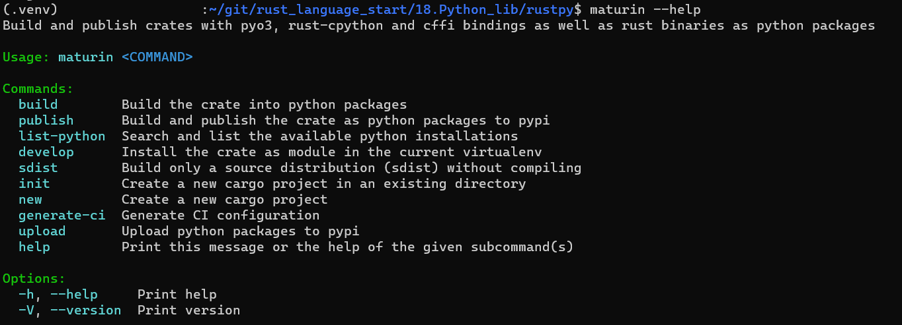

# Python with rust lib
use Rust crate PyO3
PyO3 is Rust bindings for Python 
## setting
install maturin
```shell
$ pip install maturin
```
new project
```shell
$ maturin new [project name]
$ cd [project name]
$ touch [python project name].py
```

maturin help  


## Rust code
#[pyfunction] is running function with python code
```Rust
#[pyfunction]
fn funcname(param, ...) -> PyResult<return type> {
    Ok(return value)
}
```
#[pymodule] is Python module implemented in Rust.
```rust
#[pymodule]
fn rustpy(_py: Python, m: &PyModule) -> PyResult<()> {
    m.add_function(wrap_pyfunction!(function name, m)?)?;
    ///ex m.add_function(wrap_pyfunction!(isPriemNum, m)?)?;
    Ok(())
}
```
#[pyfunction] & func is 1:1 but #[pymodule] is only one
```rust
#[pyfunction]
fn func1(a:i32) -> PyResult<i32> {
    Ok(a)
}
#[pyfunction]
fn func2(s:string) -> PyResult<string> {
    Ok("!!!")
}

#[pymodule]
fn rustpy(_py: Python, m: &PyModule) -> PyResult<()> {
    m.add_function(wrap_pyfunction!(func1, m)?)?;
    m.add_function(wrap_pyfunction!(func2, m)?)?;
    Ok(())
}
```

## Python code
import rust project name
```Python
import PyO3name
#       or 
from PyO3name import funcname, ...

# python code...
```

## rust bulid
```shell
$ maturin develop           # debug version
        # or
$ maturin develop --release #release version
```

target/debug(or release)/lib[name].so build(windows is .dll, mac is .dylib)